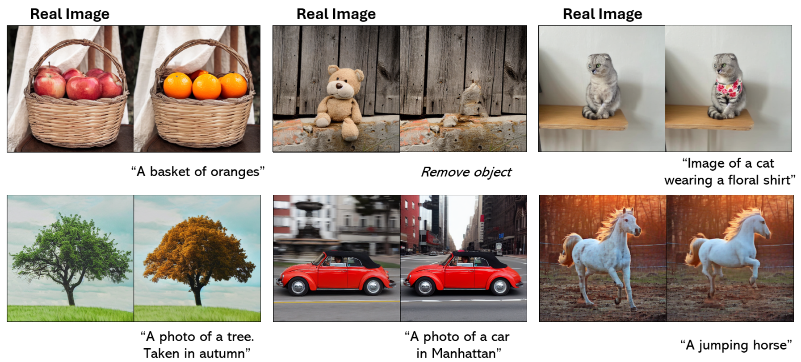
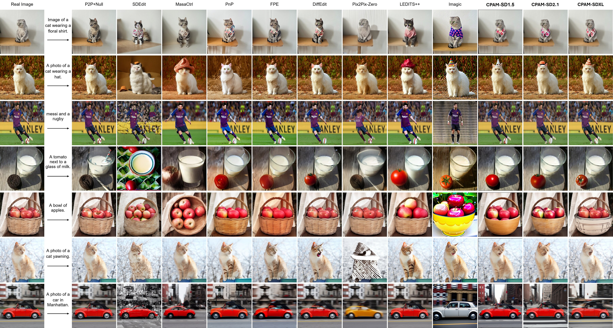

# CPAM: Context-Preserving Adaptive Manipulation

Official code and project page for **CPAM: Context-Preserving Adaptive Manipulation for Zero-Shot Real Image Editing**.

[](https://vdkhoi20.github.io/CPAM/)
[](https://arxiv.org/abs/2506.18438)
[](https://github.com/vdkhoi20/CPAM)
[](https://vdkhoi20.github.io/CPAM/)

> **Accepted to IEEE Transactions on Multimedia (TMM).**



CPAM is a tuning-free diffusion editing framework for real images. It preserves context through adaptive self-attention control while localizing prompt-driven changes with mask-guided attention extraction. This release includes a cleaned runner for **Stable Diffusion 1.5**, **Stable Diffusion 2.1**, and **Stable Diffusion XL**.

## Highlights

- Zero-shot real image editing without fine-tuning.
- Unified command-line runner for SD1.5, SD2.1, and SDXL.
- Shared configuration and attention-control code with version-specific diffusion backends.
- Dataset mode compatible with the original IMBA-style benchmark layout.
- Project page source included under the Next.js app.
- Paper figures integrated into the project page, including IMBA, mechanism analysis, ablation, user study, and limitations.

## Repository Layout

```text
CPAM/
├── cpam_script/
│   ├── attention.py
│   ├── config.py
│   ├── image_utils.py
│   ├── pipeline.py
│   └── backends/
│       ├── sd15/diffuser_utils.py
│       ├── sd21/diffuser_utils.py
│       └── sdxl/diffuser_utils.py
├── run_cpam.py
├── requirements.txt
├── src/app/             # project page source
└── public/              # project page assets
```

## Installation

```bash
git clone https://github.com/vdkhoi20/CPAM.git
cd CPAM
conda create -n cpam python=3.10 -y
conda activate cpam
pip install -r requirements.txt
```

The scripts use Hugging Face Diffusers checkpoints. If your environment is offline, prepare the model cache first and pass `--cache-dir` with `--local-files-only`.

## Usage

Run CPAM on one image:

```bash
python run_cpam.py \
  --version sd21 \
  --image path/to/image.png \
  --mask path/to/mask.png \
  --prompt "a small bonsai maple tree" \
  --output results/cpam_sd21.png
```

Run the included IMBA benchmark subset:

```bash
python run_cpam.py \
  --version sdxl \
  --dataset datasets/final_dataset_IMBA \
  --output results/imba_sdxl \
  --cache-dir path/to/huggingface_cache \
  --local-files-only
```

Available versions:

```text
sd15   Stable Diffusion 1.5, 512 x 512
sd21   Stable Diffusion 2.1, 768 x 768, v-prediction DDIM inversion
sdxl   Stable Diffusion XL, 1024 x 1024
```

The released dataset lives at `datasets/final_dataset_IMBA` and follows this layout:

```text
datasets/final_dataset_IMBA/
├── data.json
├── images/
└── masks/
```

Each record follows the original ImageEditing schema with fields such as `img_name`, `target_text`, `object`, `retain_object`, and optional `alter_mask`.

## IMBA Benchmark

The Image Manipulation BenchmArk (IMBA) extends TEdBench with richer annotations for object-level real image editing. It contains 104 editing samples and includes object prompts, alteration masks, and editing preference labels for object retention, object modification, and background alteration.

The latest paper version evaluates CPAM across multiple diffusion backbones. CPAM-SDXL achieves the best background preservation, while CPAM-SD2.1 obtains the best DreamSim score.

| Method | CLIPScore ↑ | LPIPS ↓ | DreamSim ↓ | RMSE ↓ |
| --- | ---: | ---: | ---: | ---: |
| CPAM-SD1.5 | 29.26 | 0.180 | 0.072 | 23.42 |
| CPAM-SD2.1 | 29.08 | 0.125 | **0.044** | 19.13 |
| CPAM-SDXL | **29.77** | **0.118** | **0.044** | **18.90** |

## Qualitative Results

The qualitative visualization below includes the updated CPAM results for **SD1.5**, **SD2.1**, and **SDXL**.



The project page visualizes:

- IMBA dataset construction and annotation design.
- CPAM mechanism analysis for localized cross-attention extraction.
- Additional qualitative editing results.
- Ablation results for Localized Extraction and Preservation Adaptation.
- User study rating statistics and representative failure cases.

## Project Page

The project page is built with Next.js and exported for GitHub Pages.

```bash
npm install
npm run build
```

The live page is available at [vdkhoi20.github.io/CPAM](https://vdkhoi20.github.io/CPAM/).

## Related Projects

- [CPAM Project Page](https://vdkhoi20.github.io/CPAM/)
- [PANDORA: Pixel-wise Attention Dissolution and Latent Guidance for Zero-Shot Object Removal](https://vdkhoi20.github.io/PANDORA/)
- [FocusDiff: Target-Aware Refocusing for Tuning-Free Diffusion Editing](https://vdkhoi20.github.io/FocusDiff/)

## Citation

If you find this repository useful, please cite CPAM:

```bibtex
@article{vo2026cpam,
  title={CPAM: Context-Preserving Adaptive Manipulation for Zero-Shot Real Image Editing},
  author={Vo, Dinh-Khoi and Do, Thanh-Toan and Nguyen, Tam V. and Tran, Minh-Triet and Le, Trung-Nghia},
  journal={IEEE Transactions on Multimedia},
  year={2026},
  url={https://arxiv.org/abs/2506.18438},
  code={https://github.com/vdkhoi20/CPAM}
}
```

Related work from our group:

```bibtex
@inproceedings{vo2026focusdiff,
  title={Toward 360-Degree Indoor Panorama Editing via Tuning-Free Diffusion Model with Refocusing Cross-Attention},
  author={Vo, Dinh-Khoi and Le-Hinh, Nhut-Thanh and Huynh, Viet-Tham and Nguyen, Tam V. and Tran, Minh-Triet and Le, Trung-Nghia},
  booktitle={International Conference on Computational Collective Intelligence},
  year={2026}
}
```

```bibtex
@inproceedings{Vo2026ICME,
  title = {PANDORA: Pixel-wise Attention Dissolution and Latent Guidance for Zero-Shot Object Removal},
  author = {Vo, Dinh-Khoi and Nguyen, Van-Loc and Nguyen, Tam V. and Tran, Minh-Triet and Le, Trung-Nghia},
  booktitle = {IEEE International Conference on Multimedia and Expo (ICME)},
  year = {2026},
  url = {https://arxiv.org/abs/2603.27555},
  code = {https://github.com/vdkhoi20/PANDORA},
}

@inproceedings{Vo2026DemoICME,
  title={Zero-Shot Mass-Similar and Multi-Object Removal in Single Pass},
  author={Dinh-Khoi Vo and Van-Loc Nguyen and Tam V. Nguyen and Minh-Triet Tran and Trung-Nghia Le},
  booktitle={IEEE International Conference on Multimedia and Expo (ICME)},
  year={2026},
  url = {https://vdkhoi20.github.io/PANDORA/},
  code = {https://github.com/vdkhoi20/PANDORA},
}
```
